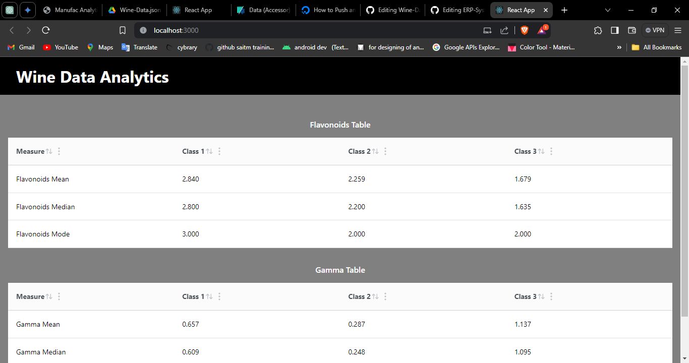
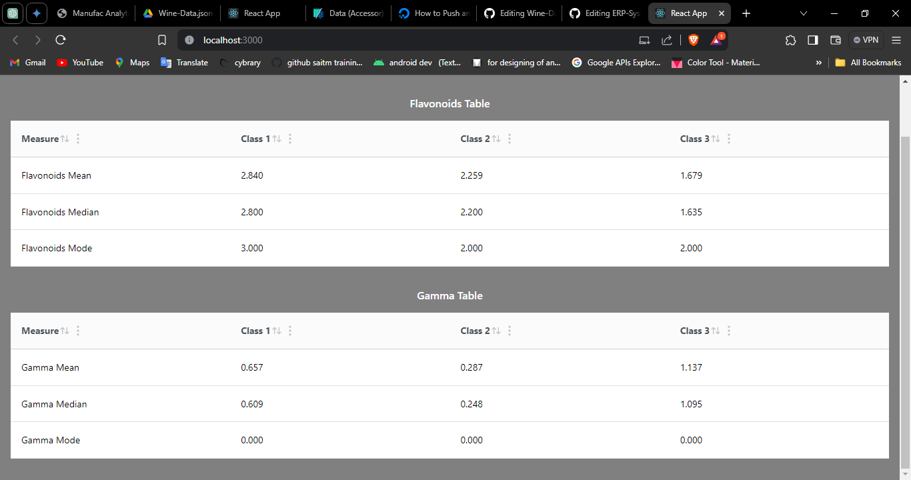

## Wine Data Analysis Task

This project is aimed at calculating statistical measures of the Wine Data Set and displaying them as tables using React with Mantine v7.

### Technologies Used
- JavaScript
- React (CRA)
- Yarn
- Mantine v7

### Screenshots
- **Flavonoids Table:**
  
- **Gamma Table:**
  

## Installation

To install and run the project locally, follow these steps:

1. Clone this repository.
2. Navigate to the project directory.
3. Run `yarn install` to install dependencies.
4. Run `yarn start` to start the development server.
4. Run `yarn build` to make build the project.

